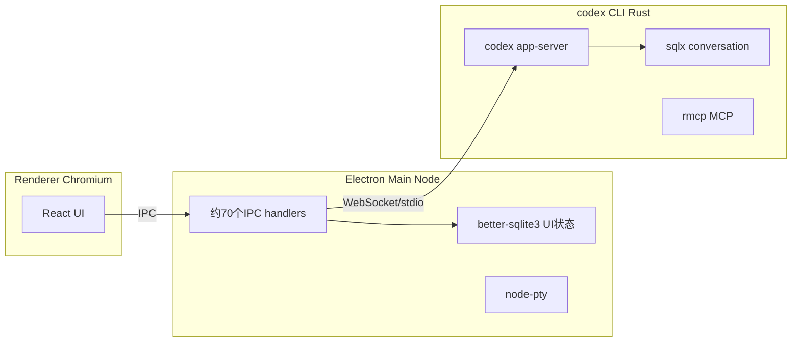
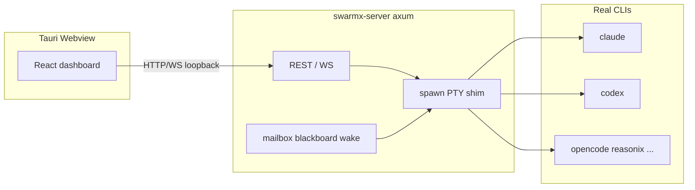

# Codex Desktop vs swarmx：技术栈与差距

> 调研日期：2026-08-14 · 方法：官方发言 / 开源 CLI app-server 文档 + 第三方 asar 逆向与 Electron 审计 + 对照 swarmx 打包与设计稿。
>
> 起因：确认官方 Codex 桌面版用什么做的，并和 swarmx 桌面方案并排看差距。

---

## 结论（先说清楚）

[KNOWN] 官方 **OpenAI Codex Desktop**（现常并入 ChatGPT desktop / Work）是 **Electron** 应用，不是 Tauri。产品负责人 Alexander Embiricos 公开说过：选 Electron 是为了和 **VS Code 扩展共用 UI 代码、尽快出 Windows**。

[KNOWN] swarmx 是 **Tauri 2** 壳 + 自研 **`swarmx-server` sidecar**，默认用 **PTY + MCP** 拉多引擎（claude/codex/opencode…）。两边表面都是「React 仪表盘 + Rust 干活」，但进程边界和产品目标差一截。

---

## Codex Desktop 长什么样

逆向/许可证清单与社区审计（Codex ~v26.x，Electron 40）给出的三层模型：

| 层 | 技术 | 职责 |
|---|---|---|
| UI | React、Radix、Tailwind、ProseMirror、xterm.js、Shiki、cmdk、Framer Motion 等 | 聊天/diff/终端/命令面板；渲染进程几乎无业务逻辑 |
| 壳 | Electron 40 + Node main | 窗口、auth fetch 代理、~70 方法 IPC、本机 SQLite、Sparkle 更新、Sentry |
| 智能 | 同一条开源 `codex` CLI，`codex app-server` | threads/turns、MCP、OAuth keychain、sqlx、tree-sitter、git/worktree |

[KNOWN] 关键设计决策：

1. **CLI-as-backend**：桌面不另写一套 agent runtime，包 Homebrew/`@openai/codex` 同款二进制。
2. **双库拆分**：Node `better-sqlite3` 管 UI/automation；Rust `sqlx` 管对话，避免跨进程锁库。
3. **Git 是上下文边界**：worktree snapshot、PR、`gh` 集成是一等公民，不是「打开文件夹」。
4. **与 VS Code 同源**：`vscode://codex/` 协议走同一 handler 注册表 → Electron / 扩展共用渲染逻辑。
5. **平台**：官方 macOS + Windows；**无官方 Linux GUI**（社区有把 DMG/`app.asar` 换成 Linux Electron 的非官方包）。安装包量级约 **300+ MiB**（bundled Chromium）。

[KNOWN] App 本身 **不开源**；开源的是 CLI 里的 **app-server 协议**（见 [`docs/design/codex-app-server-opt-in.md`](../design/codex-app-server-opt-in.md)）。

---

## swarmx 桌面长什么样

| 层 | 技术 | 职责 |
|---|---|---|
| UI | React 18、Vite、Tailwind 4、Radix、xterm.js（见 `web/package.json`） | 多 workspace / swarm 仪表盘 |
| 壳 | Tauri 2（`web/src-tauri/tauri.conf.json`） | 系统 webview、updater、sidecar 拉起 |
| 智能 | 自研 `swarmx-server` + `swarmx-shim` + `swarmx-mcp` | PTY 拉真 CLI、收件箱/黑板、wake、reaper；多引擎 |

[KNOWN] 打包策略：sidecar 二进制进 `externalBin`；roles/spells/plugins 多靠 `include_str!` embed——这是相对 Electron「整包塞 Chromium」的另一条轻量路。

---

## 并排差距（按对用户/产品影响排序）

### 1. 壳：Electron vs Tauri（战术差异，不是胜负）

| | Codex | swarmx |
|---|---|---|
| 运行时 | 自带 Chromium | 系统 WebView |
| 包体 / 内存 | 大（~300MiB 级） | 通常更小 |
| 代码复用 | 与 VS Code 扩展共用 | 仅自己的 Vite Web |
| 平台 | 官方无 Linux | 三平台一等公民（项目原则写死） |

[INFERRED] 他们选 Electron 是 **产品分发速度 + 扩展共用**；swarmx 选 Tauri 是 **体积 + Rust 同栈 + Linux**。换壳不会自动追上功能差距。

### 2. 控制面：app-server vs PTY（最大技术债）

| | Codex Desktop | swarmx |
|---|---|---|
| 默认驱动 | `codex app-server` 结构化 JSON-RPC（thread/turn/approval/activity） | PTY + Stop hook + MCP；Codex app-server 仍是 **design-only opt-in** |
| UI 能拿到的 | 工具调用、diff、审批事件是一等事件 | 大量依赖终端输出 / 自建协议 |

[KNOWN] 设计边界已钉死：app-server 适合 **structured Activity**，但默认仍应保持 PTY，且不能拿 ACP 当多 agent 默认路径（见 `docs/design/codex-app-server-opt-in.md`、`.agents/skills/swarmx-agent-upgrades/SKILL.md`）。

**差距本质**：官方桌面是「结构化控制面 + 富 UI」；swarmx 是「编排层 + 真终端」。要缩小体验差，优先做的是 Codex（及同类）的 **structured transport**，不是重写 Tauri→Electron。

### 3. 产品面：单引擎 IDE vs 多引擎 Swarm

Codex Desktop 强在：

- ProseMirror 富文档（工具卡、diff 内嵌）
- 本机 cron/automation + inbox
- Git/PR/worktree/云端 snapshot 工作流
- OAuth fetch 代理（渲染进程不见 token）
- 遥测：Sentry / Statsig / OTel

swarmx 强在：

- **多 CLI 同场**（claude/codex/opencode/…）
- **agent↔agent** 邮箱 + 黑板 + wake（Magentic-One 式编排）
- 统一生命周期（reaper、live-cap、asciicast）
- 开源可控、装完即用的 sidecar 资源策略

[INFERRED] 功能差距不是「桌面技术不行」，而是 **单 agent 开发工作台成熟度** vs **多 agent 编排** 两条产品轴。对标 Codex App 的「编辑器/自动化/Git 闭环」swarmx 基本没做；对标「swarm 协作」他们基本不做。

### 4. 前端栈重合度（其实很近）

两边都是 React + Radix + Tailwind + xterm。Codex 额外重仓：ProseMirror、Shiki、Mermaid/KaTeX/D3、多状态库（Redux/Jotai/Zustand 混用）、artifacts 查看器。swarmx UI 更偏 **运维仪表盘**（workspace/swarm/DAG/ledger），不是「带内嵌 IDE 的 agent 工作台」。

### 5. 和「社区 Codex 桌面」别混淆

| 名字 | 壳 | 关系 |
|---|---|---|
| OpenAI Codex / ChatGPT Desktop | Electron | 官方 |
| CodexMonitor 等 | 常为 Tauri | 第三方编排 Codex |
| CodexMaMi / codex-switcher | Tauri 2 | 账号/配置 companion |

对比官方产品时，应以 **Electron + app-server** 为准，不要拿第三方 Tauri companion 当官方栈。

---

## 若要对齐「体验」的务实优先级

1. **Codex `app-server` opt-in**（已有设计稿）→ Activity/审批结构化，缩小最大交互差距。
2. 富内容层（diff/tool card）按需加，不必上全套 ProseMirror。
3. 保持 Tauri；除非要强复用 VS Code 扩展或强依赖 Node native（`node-pty` 在壳内），否则换 Electron 性价比低。
4. Git/PR/automation 是 Codex 产品护城河——只在明确要做「单人 IDE 工作台」时再跟，别为了对标而堆。

---

## 信息置信度

- Electron / app-server / 与 VS Code 共用：[KNOWN]（官方发言 + 开源 CLI + 逆向文章）
- 具体依赖版本与 70 IPC 清单：[KNOWN] 来自第三方静态分析（asar/许可证），细节可能随版本漂移
- 「包体 ~330MiB」等数字：[KNOWN] 审计文数字，未在本机实测
- 产品战略解读：[INFERRED]

## 参考

- https://developers.openai.com/codex/app-server
- https://openai.com/index/unlocking-the-codex-harness/
- https://yuanjiwei.com/20250215-architecture-behind-codex/
- https://codenote.net/en/posts/famous-electron-apps-2026-research/
- 内部：[`docs/design/codex-app-server-opt-in.md`](../design/codex-app-server-opt-in.md)
- 内部：`.agents/skills/swarmx-agent-upgrades/SKILL.md`
